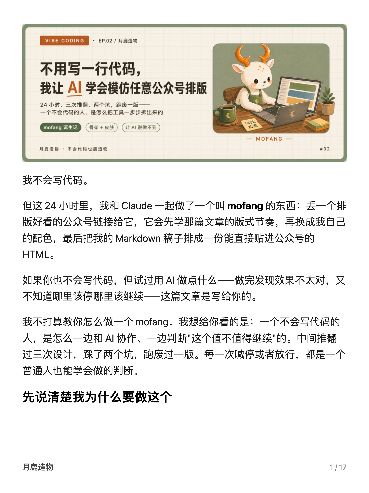
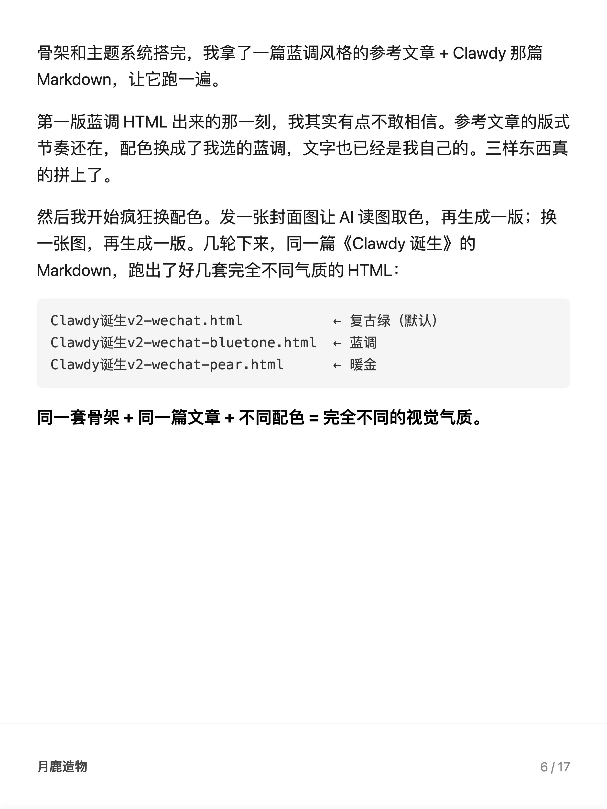
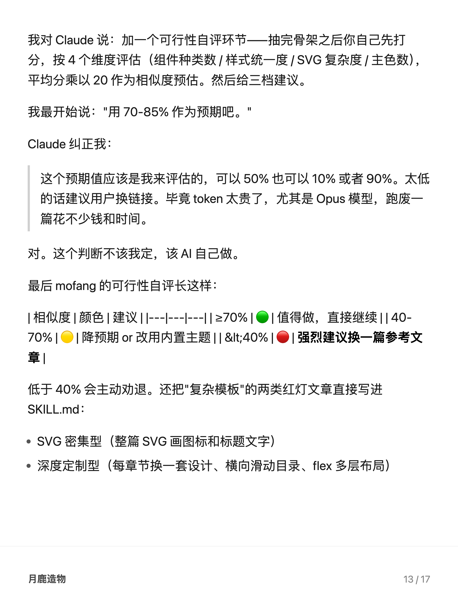

# yuelu-xhs

> 一个把 Markdown、公众号 HTML 或文章 URL 自动切页、排版成小红书轮播图的 Skill。
>
> 白底黑字 + 图文混排 + 真浏览器测量切页 + 不被裁。

## 它做什么

丢一个 Markdown、HTML 文件或公众号链接给它，它给你一组小红书 PNG 轮播图。**原文一字不改**，只是按段落自动切页 + 截图。远程配图会先缓存到输出目录，适合从公众号图文导入。

```
你的文章.md/html/URL  →  yuelu-xhs  →  16 张 1242×1656 PNG
```

不是 AI 生图，不是金句海报，不重写文章。就是把"在 Notion 里看长文"的体验，搬到小红书。

## 预览

| 封面 | 图文混排 | 整图独占 |
|---|---|---|
|  |  |  |

## 安装

```bash
# 克隆到 Claude Code 的 skills 目录
git clone https://github.com/lunaark/yuelu-xhs.git ~/.claude/skills/yuelu-xhs

# 全局装一次 playwright（只装一次，所有项目共用）
npm install -g playwright
npx playwright install chromium
```

重启会话，或新开一个会话，就能看到 `yuelu-xhs` skill 已加载。

## 用法

### 在 Claude Code /Codex/Trae里（推荐）

直接用自然语言：

```
把 articles/我的文章.md 排成小红书图文
把 articles/我的公众号文章.html 排成小红书图文
把 https://mp.weixin.qq.com/s/xxx 排成小红书图文
```

或者：

```
/yuelu-xhs articles/我的文章.md
/yuelu-xhs articles/我的公众号文章.html
/yuelu-xhs https://mp.weixin.qq.com/s/xxx
```

Skill 会自动：
1. Markdown 输入：检查文章里有没有 AI 配图但没引用，提醒你插入
2. HTML/URL 输入：提取标题、段落、引用、列表和图片，并缓存远程配图
3. 跑脚本切页 + 截图
4. 打开输出目录
5. 报告总页数

### 直接调脚本

```bash
node ~/.claude/skills/yuelu-xhs/md-to-xhs.mjs <markdown/html文件或URL> [输出目录]
```

输出在 `<输入文件同目录>/<文件名>-xhs/`；URL 输入未指定输出目录时，输出在当前工作目录：
- `<文件名>-01.png` ~ `<文件名>-NN.png` — 各页 PNG（2× 高清）
- `assets/` — 远程图片缓存目录
- `assets-manifest.json` — 图片来源、缓存路径、成功/失败原因
- `source.html` — URL 输入时保存的原始页面 HTML

## 设计取舍

这个 skill 不是为了酷炫，是为了**可读**。所以做了几个反直觉的选择：

### ✅ 做了

- **真浏览器测量**：用 Playwright 渲染所有块、量真实像素，再贪心切页 — 不靠估算字数。代价是慢 5 秒，收益是 0 误差不被裁。
- **封面图兜底**：公众号 `og:image` 如果没有出现在正文里，会作为普通首图放到第一页最上方；不会生成独立封面页。
- **访问自动重试**：公众号页面偶发超时时会自动重试，最多 3 次，降低微信网络波动导致的失败。
- **公众号噪音清理**：过滤底部互动引导、署名来源、关注二维码提示、推荐阅读等噪音，并记录到 `assets-manifest.json`。
- **图后强制完整显示**：图片如果当前页放不下，整张推到下一页，绝不裁切。
- **远程图缓存**：公众号 `mmbiz.qpic.cn` 等远程配图会下载到输出目录，避免截图时依赖原站加载。
- **失败图可见**：图片下载失败时生成占位块，并在 `assets-manifest.json` 里记录原链接和失败原因。
- **页脚极简**：只放「月鹿造物 ｜ 页码」，不放小红书号 — 因为小红书 App 自带账号水印，重了。
- **统一模板**：每页样式完全一样，没有类型化海报。读者翻页时是在"看一篇被切开的文章"，不是"刷一组金句卡片"。

### ❌ 不做

- **不用 AI 生图**。AI 生图会把文章重写成"金句海报"，破坏阅读连续性。
- **不重写文章内容**。原文什么字、图上什么字。
- **不自动填空白**。底部留白是 OK 的，硬塞文字反而会破坏章节节奏。

## 配置

页脚高度、字号、行距、安全边距等都在 [`md-to-xhs.mjs`](md-to-xhs.mjs) 顶部 30 行内的常量里：

```js
const PAGE_W = 1242;
const PAGE_H = 1656;
const FOOTER_H = 176;
const FONT_SIZE_BODY = 34;
const LINE_HEIGHT_BODY = 1.6;
const FOOTER_LABEL = "月鹿造物";  // 改成你自己的署名
```

## 输入支持

| 语法 | 渲染 |
|---|---|
| `# / ## / ###` 标题 | 加粗大字（不放大） |
| 段落 | 正文 34px / 行距 1.6 |
| `**bold**` | 加粗 |
| `*em*` | 斜体 |
| `` `code` `` | 行内灰底等宽 |
| ` ```code``` ` 块 | 浅灰底圆角框 |
| `> quote` | 左侧灰竖线 |
| `- / 1.` 列表 | 项目符号 |
| `` 图片 | 自动等比缩放，整页强制不裁 |
| `.html/.htm` | 提取标题、段落、引用、列表、图片 |
| `https://...` | 浏览器打开 URL，提取正文与图片 |

Markdown 的 YAML front matter 可用于页脚配置；HTML frontmatter、复杂表格暂不支持（按需可加）。


## 作者

[@月鹿造物](https://github.com/lunaark)。如果你也是公众号 + 小红书双平台运营，且懒得每篇手动切图，欢迎 star。

## License

MIT
